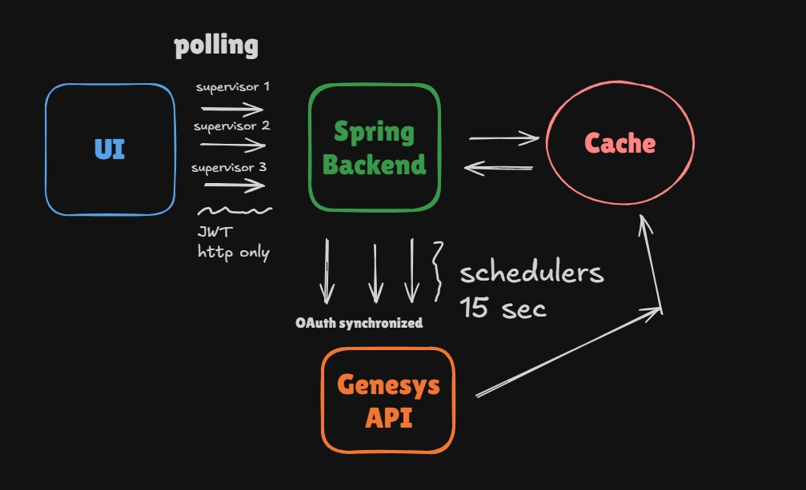
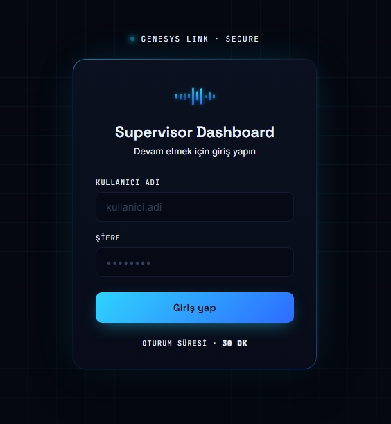
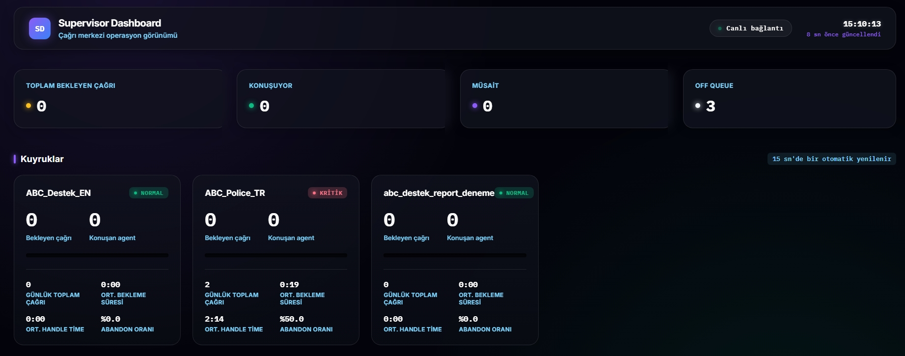
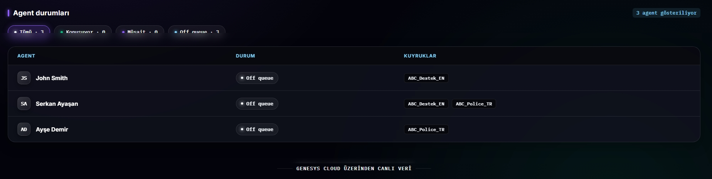
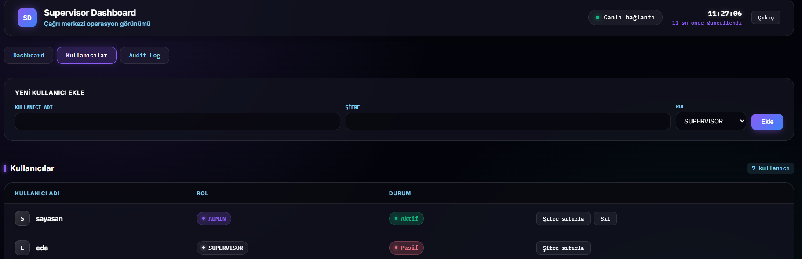
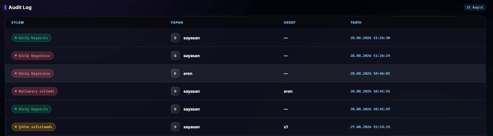

# 📊 Genesys Supervisor Dashboard

**A live supervisor panel for call center operations, powered by Genesys Cloud**

---

## Overview

A web panel where supervisors can monitor queue and agent status in near real time, and admins can additionally manage users and review an audit trail. The backend pulls data from the Genesys Cloud Analytics API and refreshes a cache every 15 seconds; the frontend polls that cache to drive the live view.

---

## Architecture Decisions

### Cache + Scheduler — constant load on Genesys

Supervisor requests never hit Genesys directly. Two independent `@Scheduled` jobs poll Genesys every 15 seconds and update a central in-memory cache. Every supervisor reads from that cache — no matter how many are watching, the load on Genesys stays constant.

- **Two separate schedulers:** queue metrics and agent status are independent data flows. They run as separate scheduled jobs so a failure in one never affects the other, and so they can run in parallel instead of adding up sequentially.
- **Thread-safe cache:** built on `AtomicReference` rather than `synchronized` — the operation is always "swap the whole value" or "read the whole value," never a multi-step check-then-act, so a lock isn't needed.
- **Stale data handling:** if a Genesys call fails, the cached data is never wiped — it's marked `stale: true` and kept as-is. The dashboard stays up and shows the last known good data through a brief Genesys outage. Only if no data has ever been fetched successfully does the API return `502`.

### Auth — JWT + httpOnly cookie, role-based access

Authentication runs on Spring Security, backed by a custom JWT filter that populates the `SecurityContext` on each request — sessions are fully stateless, no server-side session state is kept. Passwords are hashed with `BCrypt`. The token is carried as an `httpOnly` + `Secure` + `SameSite=Strict` cookie — never `localStorage` — so it can't be read or exfiltrated via XSS. Sessions last 30 minutes; there's no refresh token.

Two roles exist, `ADMIN` and `SUPERVISOR`. Authorization is enforced in two layers for defense in depth: path-based rules in the security filter chain, and `@PreAuthorize` checks at the method level. Supervisors only see the live dashboard; admins additionally get user management and the audit log.

### User management & soft delete

Admins can create users, reset passwords, and deactivate accounts. Deactivation is a soft delete (`active` flag) rather than a hard `DELETE` — a deactivated user's historical audit records stay meaningful, and Spring Security's `isEnabled()` hook automatically blocks login for disabled accounts with zero extra code on the login path.

### Audit log

Every login (successful or failed), user creation, password reset, and deactivation is recorded — who performed the action, on which target, and when. The admin-facing endpoint is paginated (`Page<AuditLog>`, backed by SQL `LIMIT`/`OFFSET`) rather than returning the full table: with a growing log, fetching everything on every view would load unbounded rows into memory and the browser. The frontend requests one page at a time and steps through with next/previous controls.

### Genesys integration

A single OAuth2 Client Credentials token is refreshed on demand through a `synchronized` service. Queue metrics are assembled by combining three separate Genesys queries (queue directory, real-time observation, and daily aggregates); agent status comes from merging queue membership data with presence/routing status.

---

## Screens

<table>
<tr>
<td width="50%"></td>
<td width="50%"></td>
</tr>
<tr>
<td width="50%"></td>
<td width="50%"></td>
</tr>
<tr>
<td colspan="2"></td>
</tr>
</table>

---

## Stack

| Layer | Technology |
|---|---|
| Backend | Java 21, Spring Boot 4.1, Spring Data JPA |
| Auth | Spring Security, JWT, BCrypt, httpOnly cookie |
| Database | PostgreSQL |
| Genesys integration | Genesys Cloud `platform-client-v2` SDK |
| Frontend | Plain HTML / CSS / JS (polling-based) |
| Deploy | Render |

---

Built on the Genesys Cloud Analytics API

